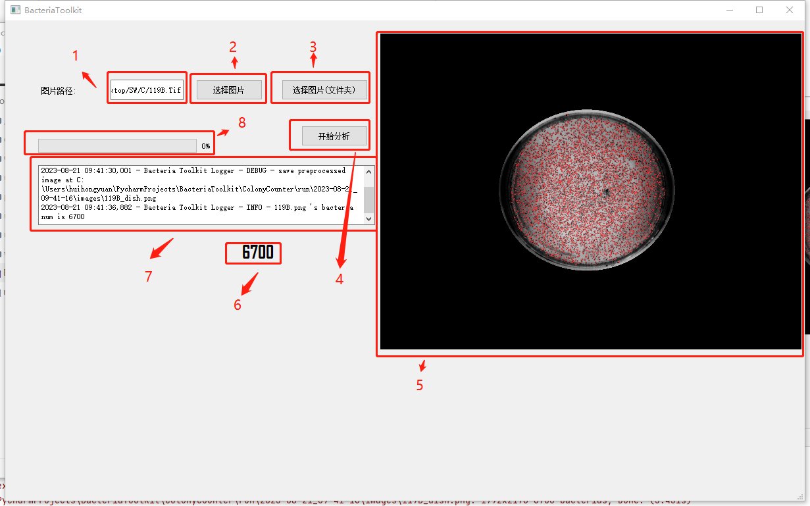

# Bacteria Toolkit

基于Yolov5的菌落计数工具，本工具用于简化模型搭建，数据标注与模型训练以及模型部署的流程。在高度可视化的工具帮助下实现针对于菌落计数程序的快速搭建与部属。

### 功能说明



1. **工作路经输入框**

   此输入框用于输入需要处理的图片文件路径或者是图片文件夹。

2. **图片选择按钮**

   点击此按钮可选择图片，对单个图片进行分析，选择完成后会自动对选择文件进行检查，如果是支持的图片格式会在图片显示区域[5]中显示出来。

3. **图片文件夹选择按钮**

   与[2]功能类似，选择文件夹，会自动处理文件夹内所有的图片。处理进度会在进度条[8]中显示出来，并且处理的结果图片都会在图片显示区域[5]中显示。

4. **开始分析按钮**

   在完成选择图片或者图片文件夹后点击此按钮会对已选择的图片进行分析。

5. **图片显示区域**

   用于显示需要处理的图片以及处理完成的图片。

6. **菌落数显示标签**

   用于显示当前处理的图片里的菌落数量

7. **处理日志显示区域**

   用于显示处理过程中的日志

8. **处理进度条**

   用于显示当前的处理进度（仅处理图片文件夹有效）


### Build

```
pip install -r requirements.txt
```

### Run

```
python launch.py
```


### 工作路径

```sh
├───data
│   ├───hyps
│   └───images
├───GUI
├───models
├───preprocess
├───run
│   └───2023-08-21_09-41-16
├───utils
│   ├───loggers
│   │   ├───clearml
│   │   ├───wandb
│   ├───tools
├───weights
```

1. data

   数据存放区域

2. GUI

   图形用户交互界面模块

3. models

   模型定义模块

4. preprocess

   输入图片预处理

5. run

   运行时工作路径，所有运行时得到的结果都在此处

6. util

   运行模型时需要的一些工具包

7. weights

   模型权重存放路径，你需要将下载的权重放在此处才能被程序找到